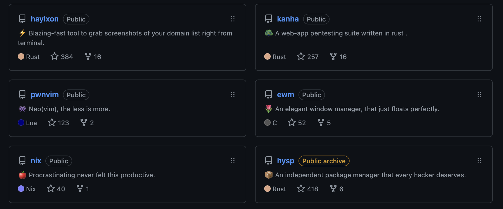

<!-- new_lines: 2 -->
┓ ┏┓   ┏┓     ┳┏┓ \
┃┃┃┣┓┏┓┣┫┏┳┓  ┃┏┛  \
┗┻┛┛┗┗┛┛┗┛┗┗  ┻• 

<!-- new_lines: 2 -->
<!-- new_lines: 2 -->

<!-- column_layout: [1, 4] -->
<!-- column: 0 -->
### Creator of METIS Linux from `github.com/metis-os`

<!-- column: 1 -->

### I make beautiful CLI apps in rust, c and so on.

### Been exploring DevSecOps lately.
### KISS and dry principles.

<!-- end_slide -->

<!-- new_lines: 2 -->
┏┓ ┓    ┓  ┓    ┏┓ \
┗┓┏┣┓┏┓┏┫┓┏┃┏┓  ┃┃ \
┗┛┗┛┗┗ ┗┻┗┻┗┗   ┗┛

<!-- new_lines: 2 -->

>NOTE: This presentation is made using flakes on nix(os) ❄️ ¹.

<!-- new_lines: 2 -->

#### What is nix(os) ?
#### A little history.
#### Using Nix on apple silicon.
#### Exploring `nix` programming language basics.
#### Using `flakes` and `direnv` to declare development envirovnment

<!-- end_slide -->

<!-- new_lines: 2 -->
┳┓┳┏┓┏┓ \
┃┃┃ ┃┃  \
┛┗┻┗┛┗┛ (the programming lang)
       

## `Nix repl` in action
